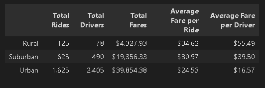

# PyBer Analysis
## Overview
PyBer is a python based ride share company.   Data has been collected from a number of urban, suburban, and rural cities that includes:
- number of drivers
- number of riders
- fares
- dates

The company would like to use the data to improve acces to ride shares and improve affordability for under served neighborhoods. 

## Results
Urban areas were found to have both the highest number of drivers as well as the highest number of rides given.  In addition, urban area average fare per ride was the lowest of each city type (urbran, suburban, rural).  Rural areas were on the opposite end of the spectrum with the least number of drivers, the least number of rides, and the highest average fare.  

## Summary
Based off of the analysis, it's possible that adding more drivers to the rural areas and decreasing the fare may increase the number of rides however, rural areas are in general less populated so this is not a guarantee.  This is more likely to work for sub urban areas that are more populated and would be more likely to utilize the service more often.  Advertisement in subrurban areas is recommended. Additionally, focussing on urban areas with a below average number of drivers could help to increase rides and there for profits in those areas.  